Since divide and conquer algorithms occur quite frequently and produce recursive equations for their run times, it is important to be able to solve recursive equations. Last lecture we "solved" the recurrence equation for merge sort using a method known as a *recursion tree*. While this method can in theory always be used, it is often cumbersome. For problems that have a fixed number of identical sized recursive pieces there is a much simpler method known as the *master theorem* that can be used to solve certain recursive equations almost "by inspection".

Master Theorem
==============

The master theorem can be employed to solve recursive equations of the form

> 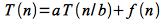

where *a* ≥ 1, *b* \> 1, and *f(n)* is *asymptotically positive*. Intuitively for divide and conquer algorithms, this equation represents dividing the problem up into *a* subproblems of size *n/b* with a combine time of *f(n)*. For example, for merge sort *a* = 2, *b* = 2, and *f(n)* = Θ(*n*). Note that floors and ceilings for *n/b* do not affect the asymptotic behavior or the results derived using the theorem.

If the recursion is in the form shown above, then the recurrence can be solved depending on one of three cases (which relate the dominance of the recursive term to the combine term):

**Case 1**

If

> 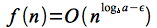

for some **constant** ε \> 0, then the solution to the recurrence is given by

> 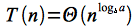

In this case, *f(n)* is *polynomially bounded* above by 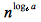 (which represents the run time of the recursive term), i.e. the recursive term dominates the run time.

**Case 2**

If

> 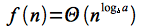

then the solution to the recurrence is given by

> 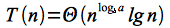

In this case, *f(n)* is "equal" to , i.e. neither term dominates thus the extra term to get the bound.

**Case 3**

If

> 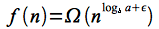

for some **constant** ε \> 0 **AND** if *a f(n/b)* ≤ *c f(n)* for some **constant** *c* \< 1 and *sufficiently large n* (this additional constraint is known as the *regularity condition*), then the solution to the recurrence is given by

> 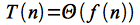

In this case, *f(n)* is *polynomially bounded* below by  (which represents the run time of the recursive term) with the additional regularity condition, i.e. the combine term dominates the run time.

Thus in all three cases it is important to compute the *recursive term run time*  and compare it *asymptotically* to the *combine term run time* to determine which case holds. If the recursive equation satifies either case 1 or case 2, the solution can then be written by inspection. If the recursive equation satisfies case 3, then the regularity condition must be verified in order to write down the solution.

Note: There are gaps between the cases where the theorem cannot be applied (as well as recursive equations that **do not** fit the form required by the theorem **exactly**). In these cases, other techniques must be used which we will see next lecture.

Procedure
=========

To apply the master theorem, the following procedure can be applied. Given the recursive equation 

> 

1. Convert any asymptotic bounds to functional notation, e.g. **Θ(n2) &rArr; cn2**
2. Identify **a**, **b**, and **f(n)**
3. Compute **nlogba**
4. Compare **f(n)** with **nlogba** to determine the proper case and write the solution to the recursive equation
    1. **Case 1:** If **f(n) = O(nlogba - ε)**, then **T(n) = Θ(nlogba)**
    2. **Case 2:** If **f(n) = Θ(nlogba)**, then **T(n) = Θ(nlogba lg n)**
    3. **Case 3:** If **f(n) = Ω(nlogba + ε)**, **AND** **af(n/b) ≤ cf(n)**, then **T(n) = Θ(f(n))**

Examples
========

**Example 1**

Solve the recursive equation

> 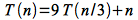

For this equation *a* = 9, *b* = 3, and *f(n)* = *n*. Intuitively this equation would represent an algorithm that divides the original inputs into nine groups each consisting of a third of the elements and takes linear time to combine the results. Computing

> 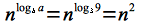

Then

> 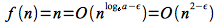

which is satisfied for any ε ≤ 1, e.g. choose ε = 1. Hence the equation satisfies *Case 1* so the solution is

> 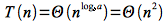

**Example 2**

Solve the recursive equation

> 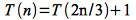

For this equation *a* = 1, *b* = 3/2, and *f(n)* = 1. Intuitively this equation would represent an algorithm that only uses two thirds of the elements at each step and takes constant time to combine the results. Computing

> 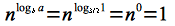

Then

> 

Hence the equation satisfies *Case 2* so the solution is

> 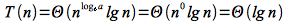

**Example 3**

Solve the recursive equation

> 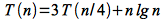

For this equation *a* = 3, *b* = 4, and *f(n)* = *n lg n*. Intuitively this equation would represent an algorithm that divides the original inputs into three groups each consisting of a quarter of the elements and takes linearlog time to combine the results. Computing

> 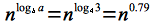

Then

> 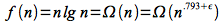

which is satisfied for any ε ≤ 0.21, e.g. choose ε = 0.2. Hence the equation *might* satisfy *Case 3* so checking regularity

> 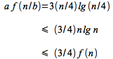

Thus regularity holds by choosing *c* = 3/4 \< 1. Therefore the equation satisfies *Case 3* so the solution is

> 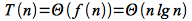

**Example 4**

Solve the recursive equation

> 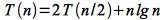

For this equation *a* = 2, *b* = 2, and *f(n)* = *n lg n*. Intuitively this equation would represent an algorithm that divides the original inputs into two groups each consisting of half of the elements and takes linearlog time to combine the results. Computing

> 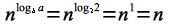

Then

> 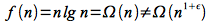

which is *almost Case 3* but while *n lg n* ≥ *n* asymptotically, it is not *polynomially bounded* - i.e. there is no ε that satisfies the above equation. Therefore *Case 3* **does not apply**.

For this example we can apply a generalization to *Case 2* which states that if

> 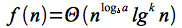

for *k* ≥ 0 (note that *k* = 0 for the standard *Case 2*), then the solution is given by

> 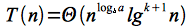

Hence for this example

> 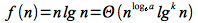

for *k* = 1. Therefore the equation satisfies the *extended Case 2* so the solution is

> 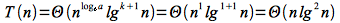

